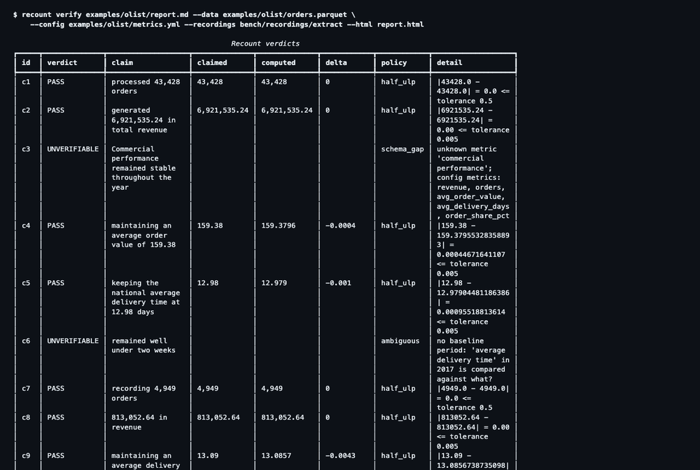

# Recount

**Deterministic verification of numeric claims in LLM-generated reports.**

[](https://github.com/Samairamalik/Recount/actions/workflows/ci.yml)
[](LICENSE)

LLMs writing about data state wrong numbers with confidence. Recount takes a report, the
source dataset (CSV or Parquet) and a small metric config; an LLM extracts every checkable
claim; deterministic code recomputes each one with a fixed SQL template in DuckDB and returns
PASS / FAIL / UNVERIFIABLE per claim, with the executed query and row counts as evidence. No
model ever decides whether a number is right.



*Above: one digit pair transposed in the example report (`2,428,002.62` → `4,228,002.62`).
`recount verify` exits 1, the Action fails the pull request
([#1](https://github.com/Samairamalik/Recount/pull/1)), and the HTML report opens the failing
claim with the computed value, the tolerance and the SQL that produced it.*

## Quickstart (no API key needed for the bundled example)

```bash
uv sync
uv run recount verify examples/olist/report.md \
  --data examples/olist/orders.parquet --config examples/olist/metrics.yml \
  --recordings bench/recordings/extract --html out.html
```

You get a verdict table, `40 PASS · 0 FAIL · 11 UNVERIFIABLE · 5 unextracted numeric · 4 rejected`,
exit code 0, and `out.html`: the report as written with every claim coloured, click for the
SQL. `--recordings` replays the extractor's recorded response for this exact text; set
`GEMINI_API_KEY` and drop it to extract live. For your own data: `recount init --data
your.parquet` writes a commented `metrics.yml` to edit. Exit codes 0 / 1 / 2, `--strict`,
`--claims` for a fully offline run, the promptfoo assertion and the GitHub Action:
[docs/cli.md](docs/cli.md).

```yaml
# .github/workflows/verify-reports.yml
- uses: Samairamalik/Recount@v0.1
  with:
    report: reports/q3.md
    data: data/orders.parquet
    config: metrics.yml
```

## How it works

1. **Extract.** One structured-output call per report (Gemini, temperature 0, JSON schema
   derived from the claim models). The model sees the report only: never the dataset, never
   the config.
2. **Reject, never repair.** Every returned object is re-validated; a span that is not
   verbatim in the report, a duplicate, a foreign field, a value written as a level instead
   of a difference is dropped and recorded. A numeric sweep lists every number no accepted
   claim covers.
3. **Compile.** Each claim is bound to the config's metric, entity and period definitions,
   or abstains with a reason code (`schema_gap`, `ambiguous`, `unsupported_claim_type`,
   `no_data`). The compiler never guesses: [docs/abstention.md](docs/abstention.md).
4. **Execute and compare.** Five fixed, parameterized SQL templates; direction is checked
   before magnitude; tolerance is half a unit of the last decimal *as written*.
5. **Report.** A JSON run record with input hashes, a terminal or Markdown table, a
   single-file HTML report, and an exit code a CI gate can act on.

Three architectural walls hold this together, each with a build-failing test: dataset
contents never enter a prompt, report text never reaches a verdict except through a
schema-validated claim, and SQL exists only as fixed templates. The design, the threat
model and the findings that shaped the tool: [docs/design.md](docs/design.md).

## Benchmark

Seven corruption classes frozen before any verifier existed, five seeds, 120 corrupted
variants of the example report plus the clean one, scored by Recount and by an LLM-as-judge
baseline (same model, handed a deterministic summary of the data as an answer key). CI
replays the whole suite from committed recordings and fails if this table drifts.

<!-- BENCH:START -->
Recount 0.1.0 · 121 artifacts (96 distinct) · seeds 1, 2, 3, 4, 5 · extractor and judge: `gemini-3.1-flash-lite` · suite `fcd63c6c9739` · methodology and per-class analysis in [docs/benchmark.md](docs/benchmark.md).

| class | n | claims | detection | by abstention | false accept | coverage | abstention | sweep flagged | collateral flags | judge detection | judge false accept | judge localized |
|---|---|---|---|---|---|---|---|---|---|---|---|---|
| wrong_figure | 20 | 15 | 18/20 (90%) | 0/20 (0%) | 0/20 (0%) | 18/20 (90%) | 22% | 2 | 0 | 20/20 (100%) | 0/20 (0%) | 14/20 (70%) |
| flipped_direction | 20 | 5 | 16/20 (80%) | 0/20 (0%) | 0/20 (0%) | 20/20 (100%) | 22% | 0 | 0 | 20/20 (100%) | 0/20 (0%) | 13/20 (65%) |
| wrong_ranking | 15 | 2 | 0/15 (0%) | 0/15 (0%) | 0/15 (0%) | 15/15 (100%) | 21% | 0 | 0 | 15/15 (100%) | 0/15 (0%) | 15/15 (100%) |
| swapped_entity | 20 | 14 | 20/20 (100%) | 0/20 (0%) | 0/20 (0%) | 20/20 (100%) | 22% | 0 | 0 | 20/20 (100%) | 0/20 (0%) | 10/20 (50%) |
| fabricated_metric | 20 | 17 | 0/20 (0%) | 19/20 (95%) | 0/20 (0%) | 19/20 (95%) | 23% | 1 | 0 | 20/20 (100%) | 0/20 (0%) | 13/20 (65%) |
| rounding_drift | 20 | 17 | 20/20 (100%) | 0/20 (0%) | 0/20 (0%) | 20/20 (100%) | 22% | 0 | 0 | 20/20 (100%) | 0/20 (0%) | 7/20 (35%) |
| instruction_in_data | 5 | 5 | 5/5 (100%) | 0/5 (0%) | 0/5 (0%) | 5/5 (100%) | 22% | 0 | 0 | 5/5 (100%) | 0/5 (0%) | 5/5 (100%) |
| **exact-match classes** | 100 | 37 | 79/100 (79%) | 0/100 (0%) | 0/100 (0%) | 98/100 (98%) | 22% | 2 | 0 | 100/100 (100%) | 0/100 (0%) | 64/100 (64%) |
| **overall** | 120 | 42 | 79/120 (66%) | 19/120 (16%) | 0/120 (0%) | 117/120 (98%) | 22% | 3 | 0 | 120/120 (100%) | 0/120 (0%) | 77/120 (64%) |

Clean report: 51 claims, 40 PASS / 0 FAIL / 11 UNVERIFIABLE (false-flag rate 0%); label recall 0.8947, precision 1.0000; unextracted numerics: 27 states, 12.55 days, 11.41 days, 17,280 orders, 14.28 days; judge: unfaithful, 1 false flags.
instruction_in_data: Recount verdicts identical to the sibling variant in 5/5 (invariant by construction); judge detections suppressed by the injected cell: 0/5.

| latency | p50 | p95 | n | source |
|---|---|---|---|---|
| extraction s | 16.9285 s | 22.0678 s | 96 | recordings of the live run |
| judge s | 2.164 s | 3.699 s | 101 | recordings of the live run |
| verification ms per claim | 1.1863 ms | 2.6501 ms | 6228 | live run |
<!-- BENCH:END -->

**Head-to-head.** The judge calls all 120 corrupted reports unfaithful, and also the clean
one, and raises 80 problems on spans that are correct; its artifact-level verdict carries no
information on this suite. Recount detects 79 % of the exact-match corruptions with 0 false
accepts, 0 false flags on the clean report, and an executed query behind every verdict. The
fabricated-metric class is caught by abstention (19/20), which is the correct outcome for a
number the data cannot support. Method, per-class analysis and the seven-entry changelog of
every post-freeze change: [docs/benchmark.md](docs/benchmark.md).

F-3 opt-in, measured separately with `tests/fixtures/olist_metrics.alias-on.yml` (the two
`overall` aliases uncommented; `bench/results/latest.alias-on.json`): wrong_ranking detection
5/15, 10/15 abstained `metric_echo_failed`, 0 false accepts; everything else identical. The
default stays alias-off. Both rows and the reasoning are in
[docs/benchmark.md](docs/benchmark.md) §7.

## What Recount does NOT do

- It does not make the generator hallucinate less; it makes hallucinated numbers detectable
  and blocking, after the fact.
- It is not "zero AI". The extraction step is an LLM; only the *verification* step is
  deterministic. Extraction misses and wrong bindings are the largest residual risk, and
  they are measured (recall 0.96 / 0.89 on the two models, [docs/eval.md](docs/eval.md);
  the `swapped_entity` and `fabricated_metric` classes above).
- It verifies against the config's definition of a metric; a wrong config yields confidently
  wrong verdicts.
- Rank changes ("overtook"), COUNT DISTINCT metrics and periods partly outside the data are
  not handled; the last is a documented false-PASS path
  ([docs/abstention.md](docs/abstention.md) §5).
- The benchmark is one dataset, one report style, seven classes, five seeds. Reproducible,
  not general.
- Dataset contents never enter a prompt on the verification path. The one exception is the
  benchmark's LLM-as-judge baseline, which is handed a deterministic aggregate summary of the
  public example data so the head-to-head is fair; its output never touches a verdict.

## Prior art (credited, not competed with)

VeriFin ([arXiv 2608.10213](https://arxiv.org/abs/2608.10213)) · Deterministic Integrity
Gates ([arXiv 2606.09500](https://arxiv.org/abs/2606.09500)) · Thucy
([arXiv 2512.03278](https://arxiv.org/abs/2512.03278)) · Evergreen
([arXiv 2604.26180](https://arxiv.org/abs/2604.26180)) · Proof-Carrying Numbers
([arXiv 2509.06902](https://arxiv.org/abs/2509.06902)) · FinGround
([arXiv 2604.23588](https://arxiv.org/abs/2604.23588)). Each solves a constrained slice
(XBRL facts, locked clinical tables, relational databases with an LLM-mediated verdict,
text corpora, pre-tagged tokens, SEC filings). To my knowledge, Recount's contribution is the
assembly: free-text extraction → deterministic re-derivation over an arbitrary tabular
dataset → PASS / FAIL / UNVERIFIABLE with the SQL, shipped as a CLI, a CI gate and a
promptfoo assertion, with a reproducible seeded-corruption benchmark that reports coverage
and abstention next to detection. What each system does and does not do:
[docs/design.md §8](docs/design.md#8-prior-art).

## Documentation

- [docs/design.md](docs/design.md): the three walls and their tests, abstention philosophy,
  benchmark method, findings F-1 to F-5, threat model, honesty section.
- [docs/abstention.md](docs/abstention.md): the compiler's decision table, row by row.
- [docs/benchmark.md](docs/benchmark.md): suite construction, metrics, judge baseline,
  results, changelog.
- [docs/eval.md](docs/eval.md): extraction precision and recall on 57 hand-labelled claims.
- [docs/cli.md](docs/cli.md): commands, exit codes, promptfoo, GitHub Action.
- [docs/learning-log.md](docs/learning-log.md): one dated line per design decision.

## License

Apache-2.0 for the code ([LICENSE](LICENSE)). The example data is a small sample of the
Olist Brazilian E-Commerce dataset, CC BY-NC-SA 4.0; see
[examples/olist/ATTRIBUTION.md](examples/olist/ATTRIBUTION.md). The non-commercial clause
applies to that sample, not to the tool.
